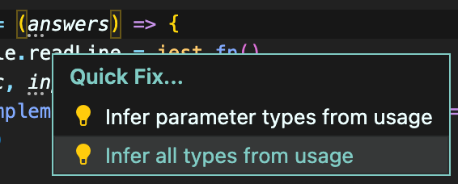
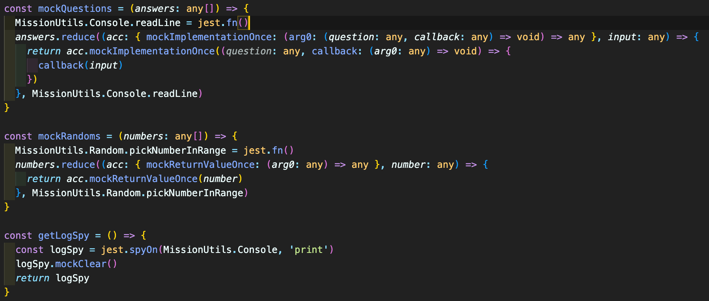

## item 23. 한꺼번에 객체 생성하기

객체를 생성할 때는 필드 값을 하나씩 추가하기보다는 여러 속성을 포함해서 한꺼번에 생성해야 타입 추론에 유리하다.

```typescript
  // count 함수의 return 타입은 Count 로 ball 과 strike 라는 속성값을 가지며, 해당 속성값들은 number 타입으로 선언되어 있다.
  #baseballGame.count(numbers: number[]): Count {
    let ball = 0
    let strike = 0

    for (let i = 0; i < this.#computer.length; i++) {
      if (this.#computer[i] === numbers[i]) strike += 1
      else if (numbers.includes(this.#computer[i])) ball += 1
    }

    return { ball, strike }
  }

  // count 함수를 호출해서 받은 ball, strike 속성값은 number 타입으로 추론된다.
  const { ball, strike } = this.#baseballGame.count(userNumbers)
```

## item 45. devDependencies 에 typescript 와 @types 추가하기

일반적으로 개발하고 테스트하는 데 사용하는 라이브러리들은 devDependencies 에 설치한다.

typescript 버전 또한 devDependencies 에서 관리하는 것이 좋다.
이는 팀원들마다 시스템 레벨로 설치한 typescript 버전이 다를 수도 있기 때문이다.

@types 도 코드를 컴파일 후엔 필요없기 때문에 devDependencies 에 추가한다.

```bash
npm install --save-dev typescript
npm install --save-dev @types/jest
```

## item 56. 정보를 감추는 목적으로 private 사용하지 않기

private 접근 제어자는 타입 시스템에서만 강제될 뿐, 런타임에서는 소용이 없다. 그렇게 때문에 정보를 감추기 위해서 사용해서는 안된다.

대신 자바스크립트에서 정보를 숨기기 위해 가장 효과적인 방법은 클로저를 사용하거나 비공개 필드 기능(#)를 사용하는 것이다.

아래의 코드에서는 #computer 를 선언하고 야구게임의 정답을 정의했다.
비공개 필드 기능을 사용함으로써 동일한 클래스 매서드에서는 접근이 가능하지만, 외부에서는 접근할 수 없도록 했다.

```typescript
class BaseballGame {
  #computer: number[] = []

  constructor() {
    this.setComputer()
  }

  setComputer() {
    while (this.#computer.length < INPUT.number_length) {
      const randomNum = Random.pickNumberInRange(INPUT.start, INPUT.end)
      if (!this.#computer.includes(randomNum)) this.#computer.push(randomNum)
    }
  }
  ...
}
```

## item 61. 의존성 관계에 따라 모듈 단위로 전환하기

아이템 61 에서는 자바스크립트 코드를 타입스크립트로 전환하는 단계를 알려준다.
전환의 마지막 단계는 테스트 코드까지 타입스크립트로 바꿔주는 것이다.

TypeScript 가 테스트 코드를 인식하기 위해서 설정을 해준다.

1. @types 라이브러리 설치한다.

```bash
npm install --save-dev @types/jest
```

2. TypeScript 컴파일러에게 jest 관련 타입 정의를 사용하도록 설정하기 위해, tsconfig.json 을 수정한다.

```json
{
  "compilerOptions": {
    "types": ["jest"]
  }
}
```

3. package.json 에 작성한 jest 설정을 수정한다.

```json
  "jest": {
    "preset": "ts-jest", // TypeScript 프리셋 사용
    "testEnvironment": "node"
  }
```

4. 테스트 파일에 jest 함수를 가져온다.

```bash
npm install --save-dev @jest/globals
```

```typescript
import { jest, describe, test, expect } from '@jest/globals'
```

5. 테스트 파일을 ts 확장자로 변경하고 코드에서 타입을 추가한다.



 

- 빠른 수정으로 적용된 속성을 훑어보고, any로 추론된 부분을 직접 수정한다.
